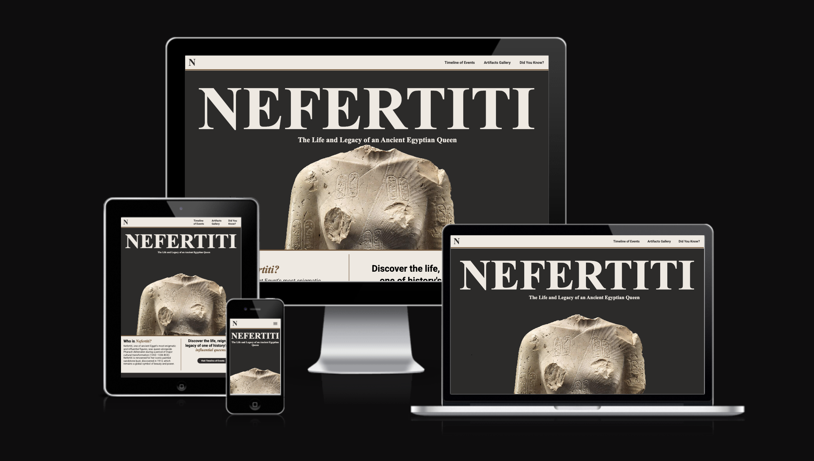

# Queen Nefertiti

1. overview of my project. 
   example:
   "Love Running is a site that hopes to help keep people motivated to meet up for runs on a regular basis in Dublin, Ireland. The site will be targeted toward runners who are looking for a way to socialise and keep themselves fit. Love Running will be useful for runners to see exactly when and where they should be to join the running club."

## Features

## Shared Features
* Navigation Bar
(image)
* Related Content links
(image)
* Newsletter signup
(image)
* Footer content
(image)

## Homepage
* Landing page image
(image)
* Introduction section Timeline of Events CTA
(image)
* Artifact Gallery CTA
(image)

## Timeline of Events
* Layout style and landing image/video
(image)
* Content structure
(image) 

## Artifact Gallery
* Bust of Nefertiti
(image)
* Artifacts gallery cards
(image)

## Artifacts information
* Content structure
* Content info
(image)

## Did you know
* Content structure
* Content info
(image)

## Features Left to Implement
* 3D model of Nefertiti Bust
* Interactive Map of ancient Egypt

## Testing

example:
In this section, you need to convince the assessor that you have conducted enough testing to legitimately believe that the site works well. Essentially, in this part you will want to go over all of your project’s features and ensure that they all work as intended, with the project providing an easy and straightforward way for the users to achieve their goals.

In addition, you should mention in this section how your project looks and works on different browsers and screen sizes.

You should also mention in this section any interesting bugs or problems you discovered during your testing, even if you haven't addressed them yet.

If this section grows too long, you may want to split it off into a separate file and link to it from here.

## Validator Testing

* HTML

* CSS

## Unfixed Bugs

example:
You will need to mention unfixed bugs and why they were not fixed. This section should include shortcomings of the frameworks or technologies used. Although time can be a big variable to consider, paucity of time and difficulty understanding implementation is not a valid reason to leave bugs unfixed.

## Deployment

example:
This section should describe the process you went through to deploy the project to a hosting platform (e.g. GitHub)

* The site was deployed to GitHub pages. The steps to deploy are as follows:

* In the GitHub repository, navigate to the Settings tab
From the source section drop-down menu, select the Master Branch

* Once the master branch has been selected, the page will be automatically refreshed with a detailed ribbon display to indicate the successful deployment.

The live link can be found here - https://code-institute-org.github.io/love-running-2.0/index.html

## Credits

example:
In this section you need to reference where you got your content, media and extra help from. It is common practice to use code from other repositories and tutorials, however, it is important to be very specific about these sources to avoid plagiarism.

You can break the credits section up into Content and Media, depending on what you have included in your project.

## Content

example: 
* The text for the Home page was taken from Wikipedia Article A

* Instructions on how to implement form validation on the Sign Up page was taken from Specific YouTube Tutorial

* The icons in the footer were taken from Font Awesome

## Media

example:
* The photos used on the home and sign up page are from This Open Source site

* The images used for the gallery page were taken from this other open source site

Congratulations on completing your Readme, you have made another big stride in the direction of being a developer!
