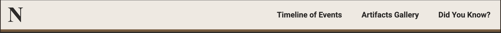
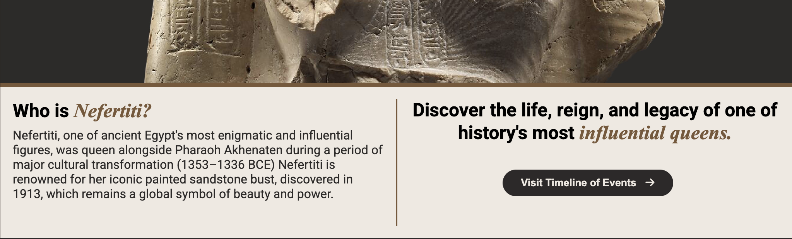

# Queen Nefertiti

# Overview

The Queen Nefertiti History Website is an engaging, user-friendly platform that provides an in-depth look into the life, reign, and legacy of Queen Nefertiti, one of ancient Egypt's most iconic figures. Designed for casual learners, history enthusiasts, educators, and researchers, the website aims to make historical learning accessible and visually captivating.

The interface complements the theme of ancient Egypt, utilizing a color scheme inspired by artifacts and a design that balances historical accuracy with modern usability.

## Key Features

### Home Page
* Fixed header for easy navigation that is responsive to mobile, tablet and larger screens.

* Full width landing hero image with overlayed text letting the useer know exactly what the website is for

* An introduction section with a call to action button linking to the Timeline of Events.

* A small preview of the Artifacts Gallery on the home page for easy navigation and exploration of the other pages relating to the artifacts.

### Timeline of Events
* A Timeline of Events explaining significant moments in Queen Nefertiti's life.

* A supporting video for a more dynamic, multimedia learning experience.

### Artifact Gallery
* An Artifact Gallery featuring detailed information on items linked to Nefertiti's era.

* The Artifact Gallery cards are clickable links that open a more detailed section on the artifacts

* This page includes a link back to the gallery for easy navigation.

### Did You Know?
* A Did You Know? section for users seeking fast facts about the Queen and her era.

### Newsletter Signup
* A newsletter signup form that appears on all pages.

### Related Content
* A related content section with links to the other pages
 

### Footer

* The footer includes information about this website.
* Secondary navigation links
* Links to sources used for the content for this website.
* Links to external websites open in a seperate tab
* Copyright information

### Features Left to Implement
* 3D model of Nefertiti Bust
* Interactive Map of ancient Egypt

## Testing

### Navigation
* I have tested all links and buttons to ensure they work and are linked to the correct section/page.
* I have tested all of the links to external websites in the footer

### Responsiveness
* I have tested the website across multiple screens to ensure the layout responds well and is as intended.

### Media Functionality
* I have tested that the video plays as intended and does not autoplay
* All images display and loads as expected

### Content Accuracy
* I have checked for grammatical errors and proper display of the text

### Loading Speed
* I have tested the website loading speed to ensure there are no delays

### Broken Links
* I have tested that any broken links are now working as intended.

### Accessibility

### Cross Browser Compatibility

## Validator Testing

### HTML

### CSS

### Bugs

### Deployment

* I went to the 'Settings' tab of my GitHub repository.
* On the left-hand sidebar, in the Code and automation section, I selected 'Pages'.
* I set 'Source' to 'Deploy from Branch'
* I selected 'Main Branch'
* I set 'Folder' to /(root).
* I clicked save
* I went back to the 'Code' tab and refreshed after a couple minutes.
* On the right sidebar, I went to deployments and viewed my deployed website.

* Live link here: https://francisjxmes.github.io/queen-nefertiti/index.html

## Credits

### Content

### Media

example: 
* The text for the Home page was taken from Wikipedia Article A

* Instructions on how to implement form validation on the Sign Up page was taken from Specific YouTube Tutorial

* The icons in the footer were taken from Font Awesome

example:
* The photos used on the home and sign up page are from This Open Source site

* The images used for the gallery page were taken from this other open source site

Congratulations on completing your Readme, you have made another big stride in the direction of being a developer!
